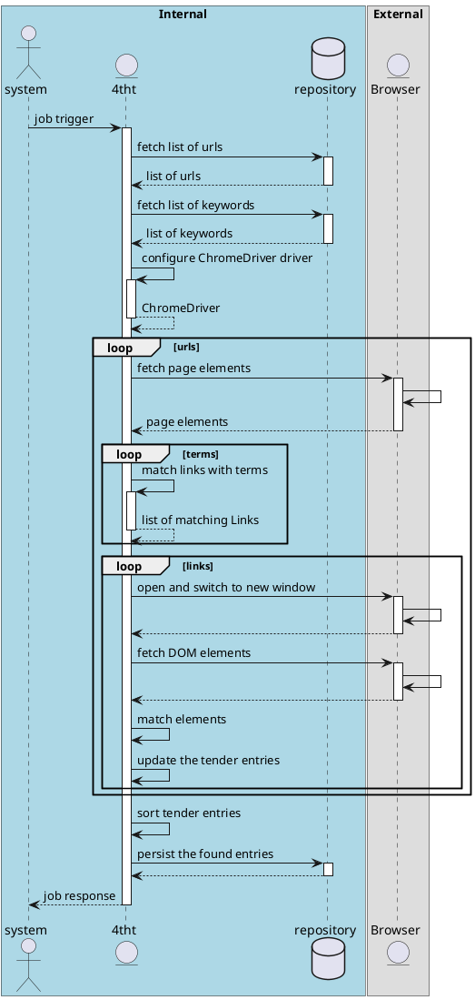

# System Sequence Diagram

This documentation comprises of a PlantUML system sequence diagram. This diagram illustrates how data flow through the system.

```plantuml
@startuml
box "Internal" #LightBlue
  actor "system" as sys
  entity "4tht" as 4
  database "repository" as db
end box

box "External"
  entity "Browser" as internet
end box

sys -> 4: job trigger
activate 4
  4 -> db: fetch list of urls
  activate db
    db --> 4: list of urls
  deactivate db
  4 -> db: fetch list of keywords
  activate db
    db --> 4: list of keywords
  deactivate db
  
  4 -> 4: configure ChromeDriver driver

  activate 4
    4 --> 4: ChromeDriver
  deactivate 4
  
  loop urls
    4 -> internet: fetch page elements
    activate internet
      internet -> internet
      internet --> 4: page elements
    deactivate internet
    loop terms
      4 -> 4: match links with terms
      activate 4
        4 --> 4: list of matching Links 
      deactivate 4
    end loop
    loop links
      4 -> internet: open and switch to new window
      activate internet
        internet -> internet
        internet --> 4: 
      deactivate internet 
      4 -> internet: fetch DOM elements
      activate internet
        internet -> internet:
        internet --> 4:
      deactivate internet 
        4 -> 4: match elements 
        4 -> 4: update the tender entries
    end loop 
  end loop
  4 -> 4: sort tender entries
  4 -> db: persist the found entries
  
  activate db
    db --> 4
  deactivate db
  
  4 --> sys: job response
deactivate 4

@enduml
```

